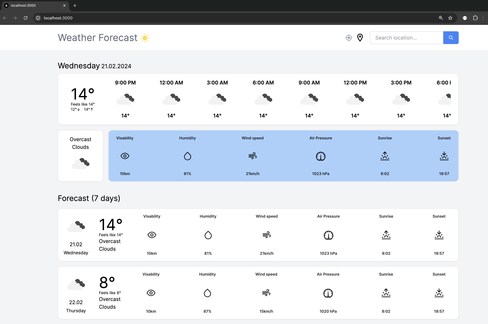

# Weather Forecast App

This Weather Forecast App is a modern, responsive web application built using Next.js, Tailwind CSS, and React. It provides a 7-day weather forecast based on your current location, showcasing the power of modern web technologies combined with a user-friendly design.



## Features

- **Current Location Detection**: Automatically detects your current location to provide a personalized weather forecast.
- **7-Day Forecast**: Get a detailed outlook of the next 7 days, including temperature highs and lows, precipitation chances, and more.
- **Responsive Design**: Crafted with Tailwind CSS for a mobile-first, responsive layout that looks great on any device.
- **Modern Technology Stack**: Built with Next.js and React for a fast, single-page application experience.

## Getting Started

### Prerequisites

- Node.js (LTS version recommended)
- npm or yarn

### Installation

1. Clone the repository:

```bash
git clone https://github.com/yourusername/weather-forecast-app.git
cd weather-forecast-app
```

2. Install dependencies:

```bash
npm install
# or
yarn install
```

3. Run the development server:

```bash
npm run dev
# or
yarn dev
```

Open [http://localhost:3000](http://localhost:3000) with your browser to see the result.

## Usage

Simply visit the homepage, and the app will automatically fetch and display the weather forecast for your current location. Navigate through the daily forecast to see detailed weather information for the upcoming week.

## License

Distributed under the MIT License. See `LICENSE` for more information.

## Contact

Vajo Lukic - [@vajolukic](https://twitter.com/vajolukic)

Project Link: [https://https://github.com/vajol/weather-forecast-app](https://https://github.com/vajol/weather-forecast-app)

## Acknowledgements

- [Next.js](https://nextjs.org/)
- [Tailwind CSS](https://tailwindcss.com/)
- [React](https://reactjs.org/)
- [OpenWeatherMap API](https://openweathermap.org/api)
- [FreeCodeCamp](https://youtu.be/KkC_wYM_Co4?si=z3M0o9GYuqyua5xC)
